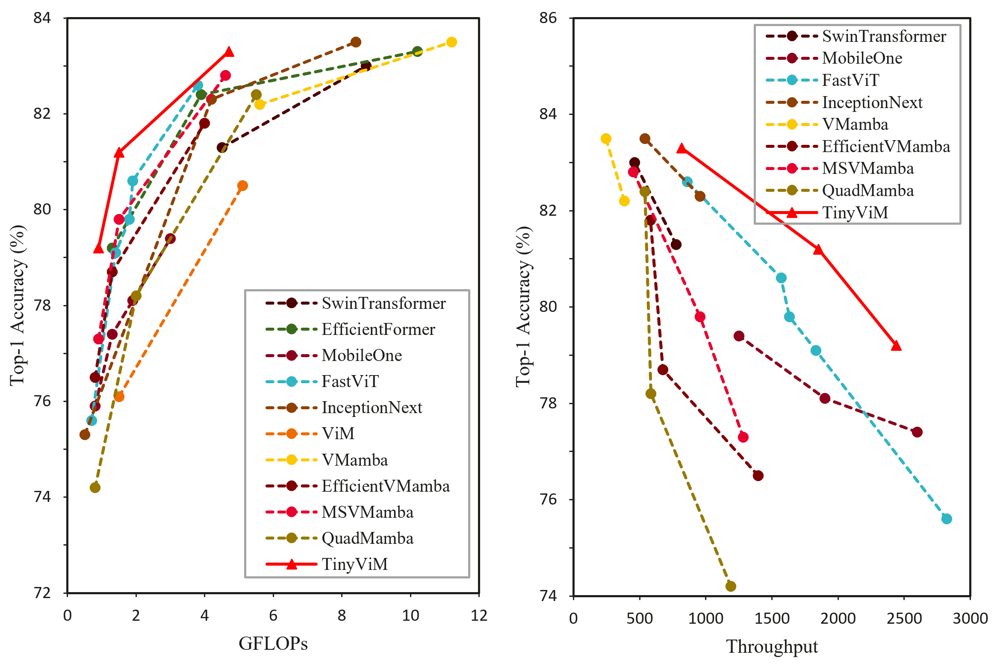
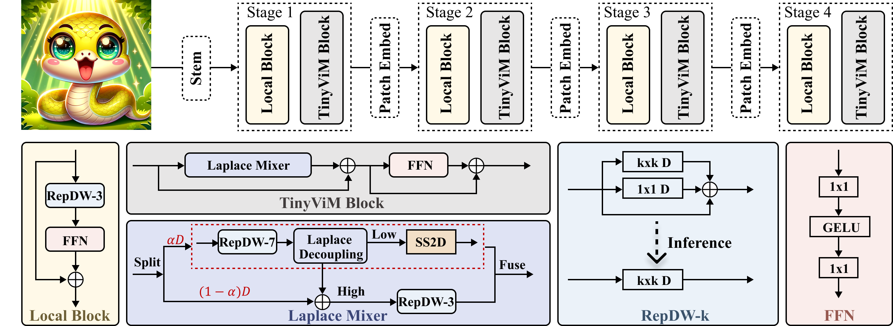

<div align="center">
<h1>TinyViM </h1>
<h3>TinyViM: Frequency Decoupling for Tiny Hybrid Vision Mamba</h3>

[Xiaowen Ma](https://scholar.google.com/citations?hl=zh-CN&user=UXj8Q6kAAAAJ),  [Zhenliang Ni](https://scholar.google.com/citations?user=2urTmpkAAAAJ&hl=zh-CN&oi=sra), [Xinghao Chen](https://scholar.google.com/citations?user=tuGWUVIAAAAJ&hl=zh-CN&oi=ao)

Huawei Noah’s Ark Lab

 [[Paper Link](https://arxiv.org/abs/2411.17473)]

</div>

## 🔥 News

- **`2025/06/26`**: **TinyViM is accepted by ICCV'25 and the checkpoints are available.**
- **`2024/11/29`**: **Code is open.**
- **`2024/11/27`**: **TinyViM is available at [Arxiv](https://arxiv.org/abs/2411.17473).**

## 📷 Introduction





We build a series of tiny hybrid vision Mamba called **TinyViM** by integrating mobile-friendly convolution and efficient Laplace mixer. The proposed TinyViM achieves impressive performance on several downstream tasks including image classification, semantic segmentation, object detection and instance segmentation. In particular, TinyViM outperforms Convolution, Transformer and Mamba-based models with similar scales, and the throughput is about 2-3 times higher than that of other Mamba-based models.


## 🏆 Performance

### 1️⃣ Classification

| Model |                           Type                           | Params (M) | GMACs | Throughput (im/s) | Top-1(300e/1000e) |
| :------------: | :----------------------------------------------------------: | ---------- | :-------: | :-------: | --------- |
|   TinyViM-S   | CNN-Mamba | 5.6     |    0.9    |    2563    |   79.2/[80.3](https://drive.google.com/drive/folders/1cLgX_Mlk9W5_nMtgwmLC71ap-RlvT7eW?usp=sharing)   |
|  TinyViM-B  | CNN-Mamba | 11.0     |    1.5    |    1851    |   [81.2](https://drive.google.com/drive/folders/1eo9RBT186E11pJFOO8uOi9S5GoR0PosS?usp=drive_link)/[82.1](https://drive.google.com/drive/folders/1nZAz0nt8Ztk7YqXbrXW8BZyPZZ49HmVx?usp=sharing)   |
|   TinyViM-L   | CNN-Mamba | 31.7    |    4.7    |    843    |   [83.3](https://drive.google.com/drive/folders/1BtxDPRyll8FVbZfbdjH-oDJU7dYKaSfY?usp=sharing)/[83.6](https://drive.google.com/drive/folders/1-nfZiEMix8Xd625M2UVFXrujIIV-K2_2?usp=sharing)   |

**We have provided the checkpoints and training logs in the table above!**

### 2️⃣  Detection & Instance Segmentation

| Model |                           Head                           | AP-box | AP-mask |
| :------------: | :----------------------------------------------------------: | :----------: | ---------- |
|     TinyViM-B     | Mask RCNN |     42.3     | 38.7       |
| TinyViM-L | Mask RCNN |     44.5     | 40.7    |

### 3️⃣ Semantic Segmentation

|   Model   | Head | Throughput | mIoU |
| :-------: | :--: | :--------: | ---- |
| TinyViM-B | FPN  |    180     | 41.9 |
| TinyViM-L | FPN  |    111     | 44.2 |


## 📚 Use example

- **Environment**

  ```shell
  conda create --name tinyvim python=3.9.11 -y
  conda activate tinyvim
  conda install pytorch==2.0.0 torchvision==0.15.0 torchaudio==2.0.0 pytorch-cuda=11.7 -c pytorch -c nvidia
  pip install timm==0.5.4
  ```
  
  Please refer to [VMamba](https://github.com/MzeroMiko/VMamba) for installing **selective_scan_cuda**.
  
  Please refer to  [mmdetection-2.28.2](https://github.com/open-mmlab/mmdetection/tree/v2.28.2) and [mmsegmentation-0.30.0](https://github.com/open-mmlab/mmsegmentation/tree/v0.30.0) for environments and data preparation of detection and segmentation, respectively. 
  
- **Train**

  ```shell
  bash train.sh
  ```
  
- **Test**

  ```shell
  bash eval.sh
  ```
  
- **speed**

  ```shell
  python speed_gpu.py --model TinyViM_S --resolution 224 --batch 2048
  ```

- **Detection & Instance Segmentation**

  ```shell
  cd detection
  bash train.sh # for train
  bash eval.sh # for eval
  ```

- **Semantic Segmentation**

  ```shell
  cd segmentation
  bash train.sh # for train
  bash eval.sh # for eval
  ```

  

## 🌟 Citation

If you are interested in our work, please consider giving a 🌟 and citing our work below. 

```
@misc{tinyvim,
      title={TinyViM: Frequency Decoupling for Tiny Hybrid Vision Mamba}, 
      author={Xiaowen Ma and Zhenliang Ni and Xinghao Chen},
      year={2024},
      eprint={2411.17473},
      archivePrefix={arXiv},
      primaryClass={cs.CV},
      url={https://arxiv.org/abs/2411.17473}, 
}
```


## 💡Acknowledgment

Thanks to previous open-sourced repo: [Efficientformer](https://github.com/snap-research/EfficientFormer), [Swiftformer](https://github.com/Amshaker/SwiftFormer), [RepViT](https://github.com/THU-MIG/RepViT), [mmsegmentation](https://github.com/open-mmlab/mmsegmentation/tree/v0.30.0), [mmdetection](https://github.com/open-mmlab/mmdetection/tree/v2.28.2)


